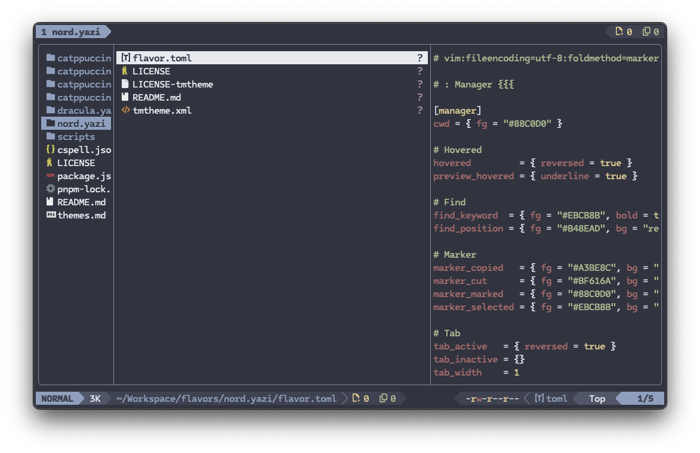

# Flavors

The "flavor" is a pre-made Yazi theme, introduced in Yazi v0.2.4, allowing users to update and expand their color schemes more conveniently.

See https://yazi-rs.github.io/docs/flavors/overview for details.

> [!TIP]
> If you've created a flavor for Yazi, please raise a PR to add your repo to the `README.md`.

## [dracula.yazi](./dracula.yazi)

## [catppuccin-mocha.yazi](./catppuccin-mocha.yazi)

## [catppuccin-latte.yazi](./catppuccin-latte.yazi)

## [catppuccin-frappe.yazi](./catppuccin-frappe.yazi)

## [catppuccin-macchiato.yazi](./catppuccin-macchiato.yazi)

## [nord.yazi](./nord.yazi)

## [moonfly.yazi](https://github.com/tkapias/moonfly.yazi)

## [nightfly.yazi](https://github.com/tkapias/nightfly.yazi)

## [onedark.yazi](https://github.com/BennyOe/onedark.yazi)

## [tokyo-night.yazi](https://github.com/BennyOe/tokyo-night.yazi)

## [kanagawa.yazi](https://github.com/dangooddd/kanagawa.yazi)

## [kanagawa-dragon.yazi](https://github.com/marcosvnmelo/kanagawa-dragon.yazi)

## [kanagawa-lotus.yazi](https://github.com/muratoffalex/kanagawa-lotus.yazi)

## [gruvbox-dark.yazi](https://github.com/bennyyip/gruvbox-dark.yazi)

## [sunset.yazi](https://github.com/PinThePenguine/sunset.yazi)

## [Ayu Dark](https://github.com/kmlupreti/ayu-dark.yazi)

## [Everforest Medium](https://github.com/Chromium-3-Oxide/everforest-medium.yazi)

## [Monokai Vibrant](https://github.com/sanjinso/monokai-vibrant.yazi)

## [Timu macOS dark](https://gitlab.com/aimebertrand/timu-macos-yazi/-/tree/main/timu-macos-dark.yazi)

## [Timu macOS light](https://gitlab.com/aimebertrand/timu-macos-yazi/-/tree/main/timu-macos-light.yazi)

## [Ashen](https://github.com/ficcdaf/ashen/tree/main/ashen.yazi)

## [Flexoki Dark](https://github.com/gosxrgxx/flexoki-dark.yazi)

## [Flexoki Light](https://github.com/gosxrgxx/flexoki-light.yazi)

## [vscode-dark-modern](https://github.com/956MB/vscode-dark-modern.yazi)

## [vscode-light-modern](https://github.com/956MB/vscode-light-modern.yazi)

## [vscode-dark-plus](https://github.com/956MB/vscode-dark-plus.yazi)

## [vscode-light-plus](https://github.com/956MB/vscode-light-plus.yazi)

## [rose-pine](https://github.com/Mintass/rose-pine.yazi)

## [rose-pine-moon](https://github.com/Mintass/rose-pine-moon.yazi)

## [rose-pine-dawn](https://github.com/Mintass/rose-pine-dawn.yazi)

## Themes

We [recommend using the new flavor format](https://yazi-rs.github.io/docs/flavors/overview/#why-flavor), but if you're still interested in themes, check out the [Themes](./themes.md) page.
