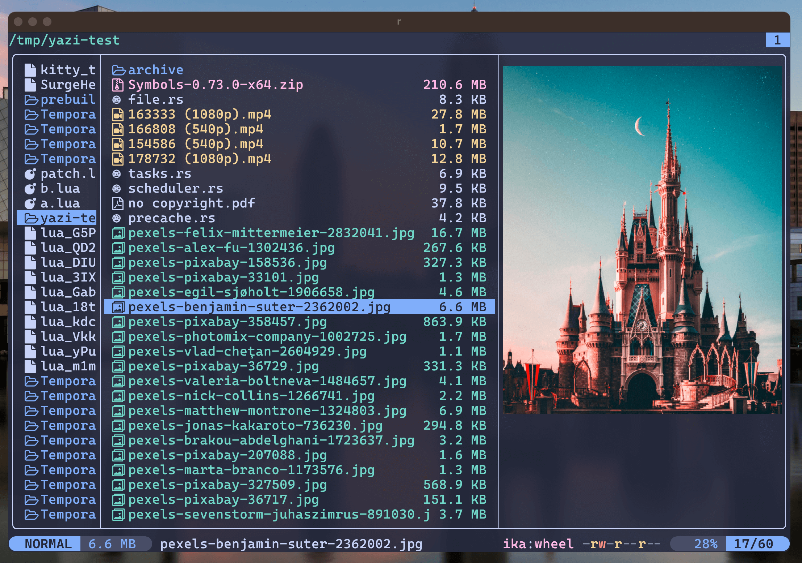

# Themes

Pick your preferred theme file, copy it as `~/.config/yazi/theme.toml` or `C:\Users\YourName\AppData\Roaming\yazi\config\theme.toml`.

> [!TIP]
> If you've created a theme for Yazi, please raise a PR to add your repo to the `README.md`.

## [Catppuccin Mocha](./catppuccin-mocha.yazi)

## [Catppuccin Latte](./catppuccin-latte.yazi)

## [Catppuccin Frappe](./catppuccin-frappe.yazi)

## [Catppuccin Macchiato](./catppuccin-macchiato.yazi)

## [Crystal](https://github.com/sachinsenal0x64/crystal-theme)

## [Gruvbox Dark](https://github.com/poperigby/gruvbox-dark-yazi)

## [Flexoki](https://github.com/Reledia/flexoki.yazi)

## [Rosé Pine](https://github.com/Msouza91/rose-pine.yazi)

