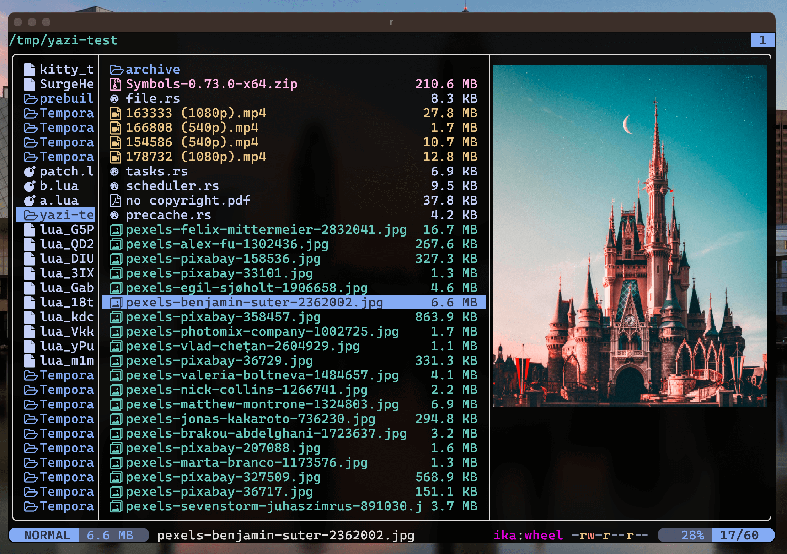

<div align="center">
  
</div>

<h3 align="center">
	Catppuccin Frappe Flavor for <a href="https://github.com/sxyazi/yazi">Yazi</a>
</h3>

## 👀 Preview



## 🎨 Installation

Download and copy this folder as:

- `~/.config/yazi/flavors/catppuccin-frappe.yazi` on Linux/macOS
- `%AppData%\yazi\config\flavors\catppuccin-frappe.yazi` on Windows

## ⚙️ Usage

Add these lines to your `theme.toml` configuration file to use it:

```toml
[flavor]
use = "catppuccin-frappe"
```

## 📜 License

The flavor is MIT-licensed, and the included tmTheme is also MIT-licensed.

Check the [LICENSE](LICENSE) and [LICENSE-tmtheme](LICENSE-tmtheme) file for more details.
