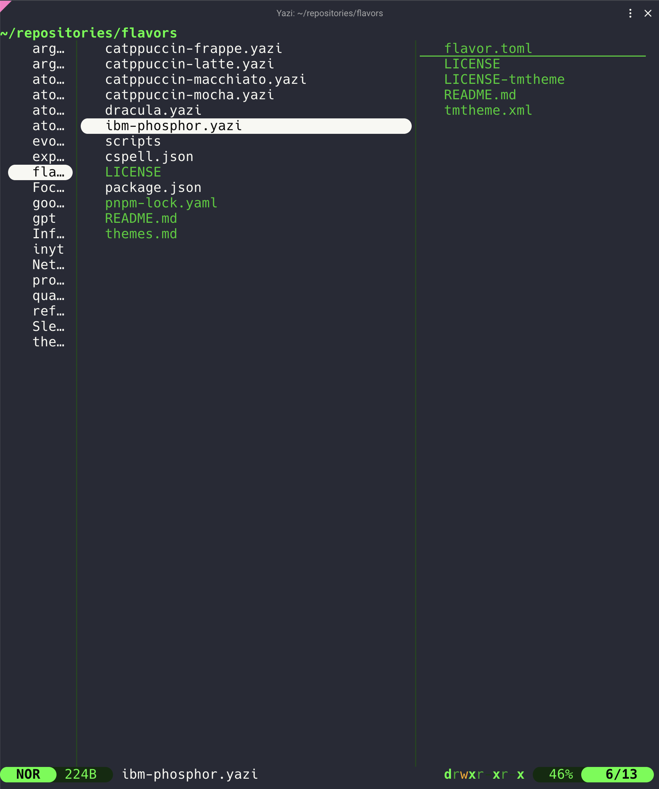

<div align="center">
  
</div>

<h3 align="center">
	IBM Phosphor Flavor for <a href="https://github.com/sxyazi/yazi">Yazi</a>
</h3>

<p align="center">
	A retro CRT terminal theme inspired by IBM 3278 phosphor displays — black background with layered green text and amber accents.
</p>

## Preview



## Installation

```sh
ya pkg add yazi-rs/flavors:ibm-phosphor
```

## Usage

Set the content of your `theme.toml` to enable it as your _dark_ flavor:

```toml
[flavor]
dark = "ibm-phosphor"
```

Make sure your `theme.toml` doesn't contain anything other than `[flavor]`, unless you want to override certain styles of this flavor.

See the [Yazi flavor documentation](https://yazi-rs.github.io/docs/flavors/overview) for more details.

## Design

- **Background**: `#0a0a0a` — not pure black, mimicking real CRT phosphor off-state
- **Four green layers**: bright phosphor `#33ff33` → standard `#22cc22` → dim `#1a6e1a` → deep `#0d2b0d`
- **Amber accent** `#ffaa00` — used sparingly for warnings: write permissions, cut markers, symlinks
- **File differentiation by brightness + style**: directories (bold), executables (underline), symlinks (italic amber), hidden files (dim)

## License

The flavor is MIT-licensed, and the included tmTheme is also MIT-licensed.

Check the [LICENSE](LICENSE) and [LICENSE-tmtheme](LICENSE-tmtheme) file for more details.
